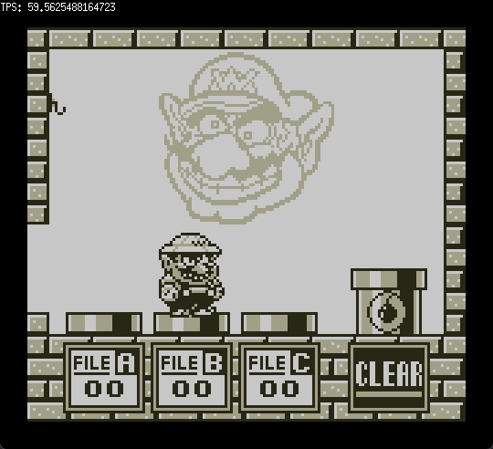

# GophersGame
_____
GophersGame is a Game Boy™ emulator written in Go.

## Development Status
#### IN PROGRESS!
All major parts except for the APU are implemented.

The emulator passes most of blarggs test roms, the mooneye test suite and is able to play most gameboy games.

Features that are still missing and / or incomplete: 
 * Cartridge headers 
 * Audio
 * Cycle-accurate timings for all memory and instruction behaviors
 * Game Boy Color™ compatibility
 * QoL features (Fast-Forward, Save States, Input-Remapping, etc.)

### How to use
for now, simply fetch the dependencies, compile main.go and launch with your .gb file as an argument.

### Screenshots

